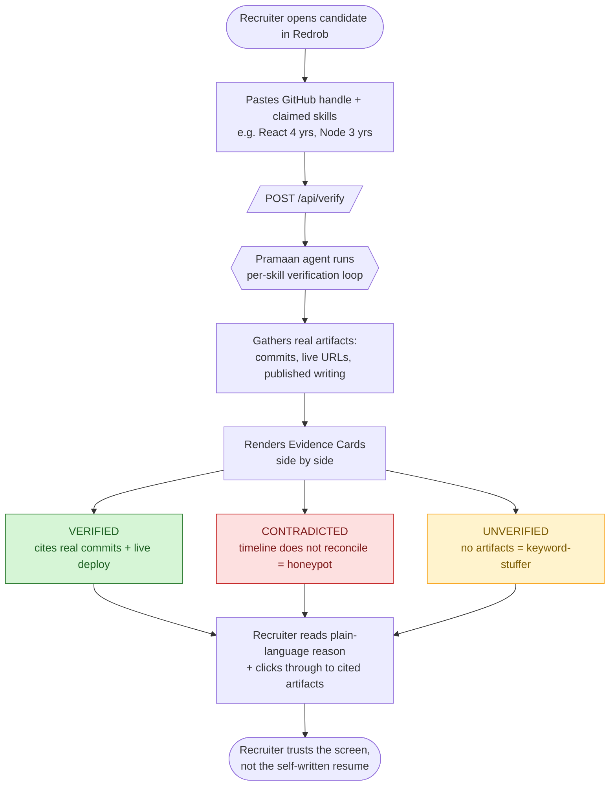
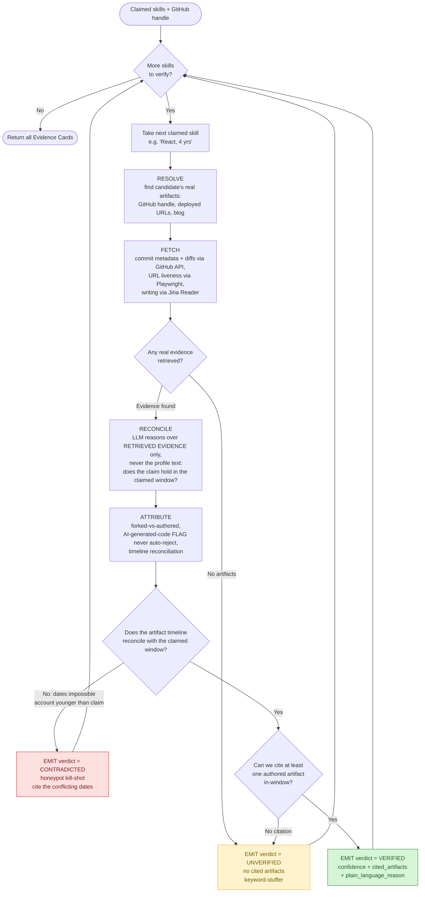
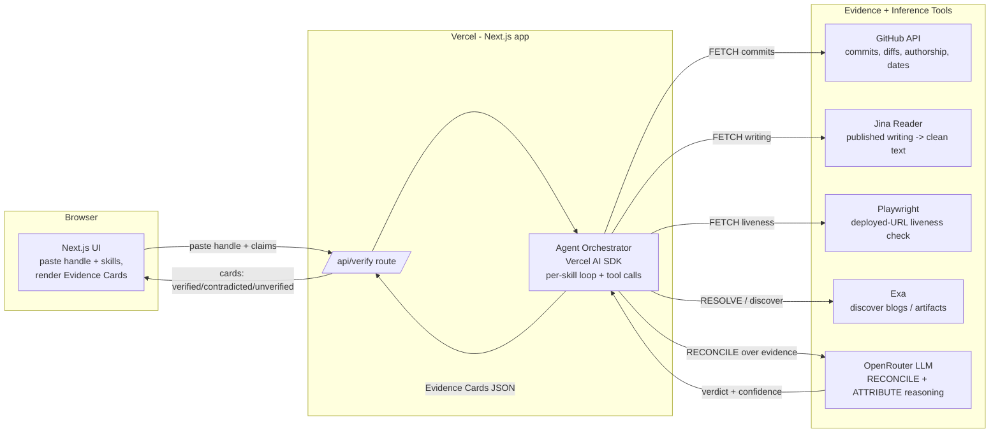
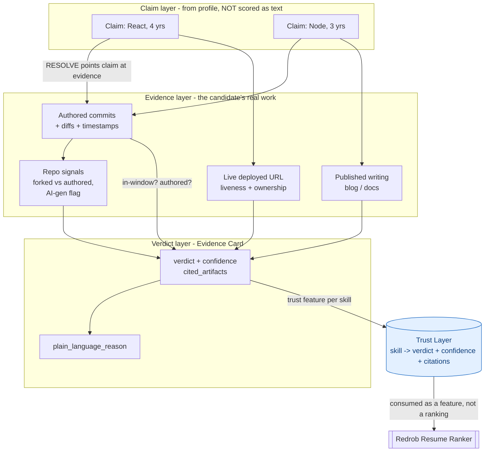

# Pramaan — 5 Mandatory Diagrams (Mermaid)

## 1. User Journey / Workflow

> A recruiter pastes one handle + claimed skills and gets back evidence-backed cards (Verified / Contradicted / Unverified) instead of trusting the candidate's own resume text.



## 2. AI Logic & Decision Flow

> The per-skill agent loop RESOLVE->FETCH->RECONCILE->ATTRIBUTE->EMIT: it reasons only over retrieved evidence, returns UNVERIFIED unless it can cite an in-window authored artifact, and kills honeypots when the timeline refuses to reconcile.



## 3. System Architecture

> A thin Next.js app on Vercel: the UI calls /api/verify, an AI-SDK orchestrator runs the agent loop, and tools (GitHub API, Jina, Playwright, Exa, OpenRouter) supply evidence and reasoning, returning Evidence Cards as JSON.



## 4. Data / Context / Intelligence Layer

> The intelligence layer is an evidence graph (claim -> artifacts -> verdict): each skill resolves to real artifacts, those produce a cited verdict + confidence, and the result becomes a trust feature the Resume Ranker consumes rather than a competing score.



## 5. Redrob Ecosystem Integration

> Pramaan plugs into Redrob as a trust layer beside the Resume Ranker and People Search via one clean verify API, issuing Verified-skill badges whose network effect (more verified candidates -> more recruiter trust -> more verification) compounds the moat.

```mermaid
flowchart LR
    subgraph Candidate[Candidate-facing]
        Profile[Candidate profile<br/>self-authored claims]
    end

    subgraph Redrob[Redrob platform]
        Ranker[[Resume Ranker<br/>scores fit]]
        Search[[People Search]]
        Badge{{Verified-skill badge}}
    end

    subgraph Pramaan[Pramaan - Trust Layer]
        API[/Clean API contract:\nPOST verify {handle, claims}\n-> Evidence Cards[]/]
        Engine[Provenance engine<br/>agent loop + evidence graph]
    end

    Profile -->|handle + claims| API
    API --> Engine
    Engine -->|Evidence Cards:<br/>verified / contradicted / unverified| API

    API -->|trust signal per skill| Ranker
    API -->|filter by verified skills| Search
    API -->|verified -> issue badge| Badge

    Badge -->|badge shown on profile| Profile
    Badge -.->|more verified candidates<br/>=> recruiters trust the badge<br/>=> more candidates verify| Profile

    Ranker -->|better-trusted shortlist| Outcome([Hiring decision])

    classDef pramaan fill:#ede7f6,stroke:#5e35b1,color:#311b92
    class API,Engine pramaan
```

