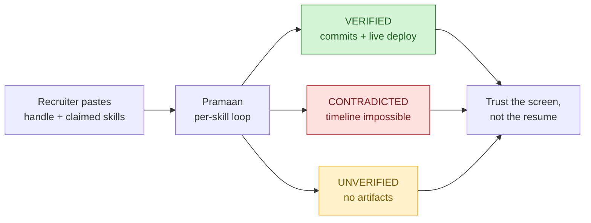
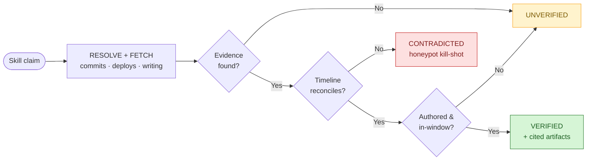
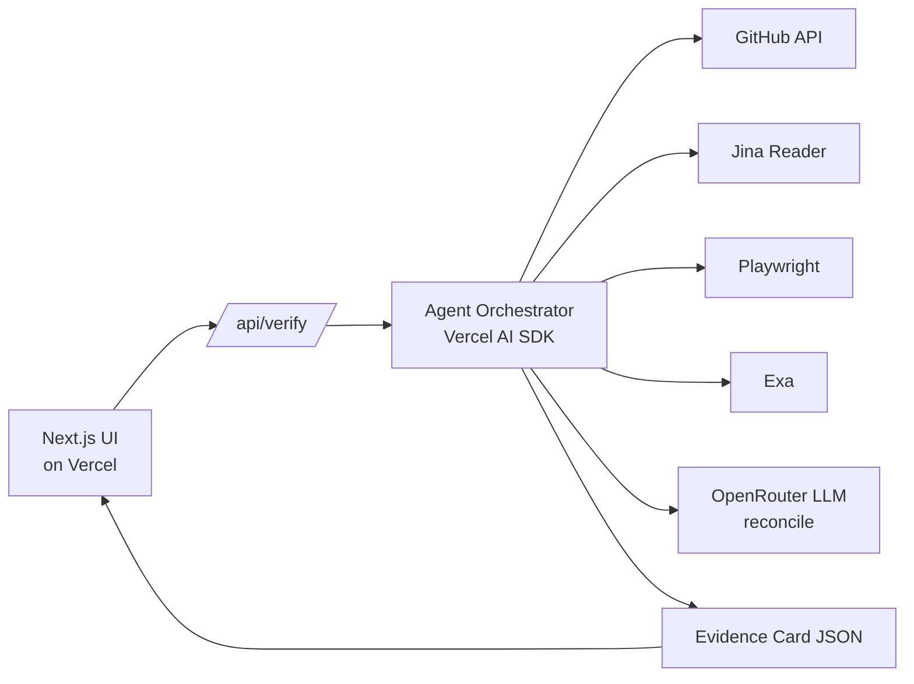
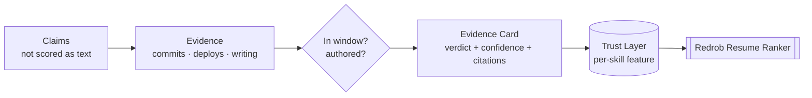
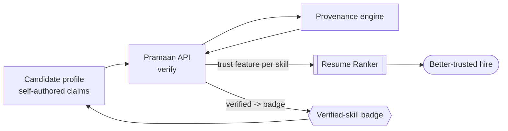

# Stop scoring the resume. Score the proof.

### Redrob's Resume Ranker grades what a candidate *wrote about themselves*.
### That's why the data is full of keyword-stuffers and ~80 impossible honeypots.

**Pramaan** (प्रमाण — "proof") doesn't read the profile.
It verifies the **evidence the profile points at**: real commits, live deployments, published work — inside the claimed time window.

> Fraud isn't a text problem. It's a provenance problem.
> Provenance is cheap to verify, expensive to fake.

*hack2skill × Redrob "India Runs" Ideathon — Sub-track 1 (deep technical / AI-native)*

---

# Where Pramaan fits

**Redrob's promise:** hire on *real data*, not resumes.
**Redrob's reality:** the Resume Ranker still scores resume *text* — so it ranks the best self-describers, not the best builders.

The signal Redrob already exposed:
- Profiles stuffed with keywords to game the ranker
- ~80 "impossible" honeypot profiles seeded to catch fakes

**Ideathon scope (Sub-track 1):** an AI-native, explainable PoC Redrob could fold into its roadmap.

Pramaan is the missing piece between a claim and a hire:
a **verification layer** that sits *under* the Resume Ranker, not beside it.
We don't replace the ranker. We feed it ground truth.

---

# The problem: you're grading self-description

A resume says **"React, 4 years."** The ranker scores the *sentence*.

Three ways that sentence lies — all invisible to a text scorer:

| Failure | What the text says | What's actually true |
|---|---|---|
| **Keyword-stuffer** | "React, Node, K8s, Rust, ML" | Zero artifacts behind any of it |
| **Honeypot / fabricator** | "Led X in 2021" | Timeline doesn't reconcile — couldn't have |
| **Borrowed credit** | "Built this repo" | Forked it; never authored a line |

The harder you tune a text model, the better it ranks **fluent liars**.
You can't out-prompt this. The ground truth isn't in the profile — it's in the **artifacts the profile cites**.

---

# Opportunity & vision

**Today:** hiring trust is manual. A senior engineer opens the GitHub, reads commits, checks if the deploy is live. It doesn't scale to Redrob's funnel.

**The vision:** make that senior-engineer judgment **automatic, cited, and explainable** — one Evidence Card per claimed skill.

Pramaan turns every skill claim into a verdict:
**verified · unverified · contradicted** — each with the artifacts it's based on and a plain-language reason a recruiter can read in 5 seconds.

The output is a **Trust Layer**, not a ranking. Redrob keeps owning the ranking decision; we give it evidence it can defend to a hiring manager.

---

# Solution: the Proof-of-Work Graph

For every claimed skill, Pramaan runs one agent loop:

1. **RESOLVE** — find the candidate's real artifacts: GitHub handle, deployed URLs, blog
2. **FETCH** — commit metadata + diffs (GitHub API), URL liveness (Playwright), published writing (Jina Reader), discovery (Exa)
3. **RECONCILE** — the LLM reasons over *retrieved evidence only* — never the profile text — to decide if the claim holds in its window
4. **ATTRIBUTE** — forked-vs-authored · AI-generated-code **flag** (never auto-reject) · timeline reconciliation (the honeypot kill-shot)
5. **EMIT** — an **Evidence Card**: `{ skill, verdict, confidence, cited_artifacts[], plain_language_reason }`

**Core rule:** the model is allowed to see proof. It is *never* allowed to see the candidate's own description of themselves.

---

# User journey

Recruiter pastes a profile; Pramaan returns cited Evidence Cards in seconds.

**Candidate** submits Redrob profile + linked artifacts (GitHub, deploys, writing).
**Pramaan** runs the loop per skill, in the background — no candidate friction.
**Recruiter** opens the profile and sees Evidence Cards inline: green/grey/red, each clickable down to the exact commit or live URL.
**Verdict in seconds**, not a 20-minute manual GitHub dig — and defensible to the hiring manager.

---

# AI logic & decision flow

Verdict is deterministic on evidence; the LLM only writes the reason.

The verdict is **deterministic on evidence, reasoned by the LLM**:

- **No artifacts found** → `UNVERIFIED` (keyword-stuffer). We never punish; we just don't confirm.
- **Artifacts exist, authored, within window** → `VERIFIED` + citations.
- **Artifacts contradict the claim** (forked-only, or timeline doesn't reconcile) → `CONTRADICTED` (honeypot caught).
- **AI-generated-code signal** → attach a **FLAG**, keep the verdict. Using AI is not fraud; *lying about authorship* is.

Confidence scales with evidence strength: a merged commit with a diff beats a one-line README edit.

---

# System architecture

Serverless on Vercel; read-only public-data connectors; model-agnostic via OpenRouter.

- **Frontend:** Next.js on Vercel — profile input + Evidence Card UI
- **Orchestration:** Vercel AI SDK agent loop; LLM via **OpenRouter** (model-agnostic, swap for cost)
- **Evidence connectors:** GitHub API · Jina Reader · Playwright · Exa
- **Output contract:** a typed Evidence Card JSON the Resume Ranker consumes

Stateless per run, serverless, no infra to babysit. Every connector is read-only on public data.

---

# Data, context & intelligence layer

Retrieval-grounded: the model reasons over fetched evidence, not profile text.

Pramaan's intelligence is **retrieval-grounded** — the model reasons over evidence we fetched, not over training memory or profile text.

- **Evidence corpus (per candidate, ephemeral):** commit diffs, repo ownership graph, deploy responses, published articles
- **Window filter:** every artifact is timestamped and checked against the *claimed* window — this is what kills the honeypot
- **Attribution graph:** author vs contributor vs forker, resolved from commit authorship not repo ownership
- **Citation store:** every verdict carries the artifacts it stands on, so nothing is unexplainable

No candidate PII is stored. We keep verdicts + citations, then discard raw evidence.

---

# Scalability & feasibility: cheap by design

The expensive step is *fetching*, and fetching is **mostly free**:

- GitHub API, URL liveness, Jina Reader — public, near-zero cost
- The LLM only sees a **distilled evidence summary**, not raw diffs → small context → cheap inference
- **OpenRouter** lets us route easy verdicts to a small/cheap model and escalate only ambiguous ones
- Cache by `{handle, skill, artifact-hash}` — a candidate re-checked tomorrow costs ₹0

Target: **a few cents per fully-cited candidate.** Verification stays cheaper than fraud — that's the whole point.

Serverless on Vercel means it scales to Redrob's funnel with zero ops.

---

# Redrob ecosystem integration

A trust layer beneath the Resume Ranker; the Verified badge compounds the network effect.

Pramaan slots in as a **trust layer beneath the Resume Ranker** — a clean contract, not a rebuild:

- Redrob sends `{ candidate_id, claimed_skills[], artifact_links[] }`
- Pramaan returns `Evidence Cards[]`
- The Ranker uses verdicts as **features** (verified skills weighted up, contradicted ones flagged for review)

Recruiters see cards inline in the existing Redrob profile view. No new product surface to learn. The honeypot profiles become a **live regression test** for Redrob: Pramaan should flag them every time.

---

# Impact & what we measure

We frame these as **targets we instrument**, not claims:

- **Honeypot catch rate** — % of the ~80 seeded fakes marked `CONTRADICTED`. North-star metric.
- **Keyword-stuffer precision** — claims with zero artifacts correctly marked `UNVERIFIED`.
- **Recruiter time-to-trust** — minutes of manual GitHub digging removed per profile.
- **False-flag rate** — legit candidates wrongly contradicted (must stay near zero; we bias toward `UNVERIFIED` over false `CONTRADICTED`).
- **Cost per verified candidate** — kept in cents.

Every number is auditable because every verdict cites its artifacts.

---

# Bharat: proof without a resume

Most of India's workforce has **no GitHub and no resume** — but they have proof of work.

**Pramaan on vernacular voice notes:** a candidate describes a job in Tamil/Hindi/Telugu; we transcribe, then verify against *real artifacts* — a UPI transaction history, a delivery-app rating, photos of completed work, a shop's Google listing.

Same engine, different evidence connectors. The thesis generalizes: **score the proof, whatever form it takes.**

**Verified Skill Passport:** a portable, cited proof-of-work record a worker carries across platforms. Owned by the worker, verifiable by anyone. That's the long-term moat — and it's India-first.

---

# Roadmap

**Now (PoC):** GitHub + deploy + writing → 3 Evidence Card verdicts, live.

**Next:** ranker integration contract · caching layer · confidence calibration against the honeypot set.

**Then:** more evidence connectors (npm, Kaggle, design portfolios, Stack Overflow) · recruiter feedback loop to tune confidence.

**Bharat track:** vernacular voice intake · non-code evidence connectors · Verified Skill Passport pilot.

Each step adds **depth on the core verdict**, not surface area.

---

# Demo

Recruiter pastes a profile; Pramaan returns cited Evidence Cards in seconds.

**Live, 60 seconds:** paste a GitHub handle + claimed skills → three Evidence Cards render side by side.

- 🟢 **VERIFIED** — "React" → cites 3 authored commits + a live deployed URL, all inside the claimed window
- 🔴 **CONTRADICTED** — "Led project in 2021" → timeline doesn't reconcile → honeypot caught
- ⚪ **UNVERIFIED** — "Rust, 5 yrs" → no artifacts found → keyword-stuffer

Each card is clickable down to the source artifact.

**Repo + live demo:** `[link]` · **Deck PDF:** `[link]`

*Built with Next.js + Vercel AI SDK; LLM via OpenRouter. AI tooling used in the build, disclosed honestly.*

---
class: text-center
---

# The asymmetry is the moat

### Faking a resume is free. Faking a year of authored commits, a live product, and a reconcilable timeline is not.

Pramaan stops scoring **what candidates say** and starts scoring **what they can prove** — cited, explainable, cheap, and India-ready.

**Stop grading self-description. Verify the proof.**

प्रमाण — *Pramaan*

*Thank you. Questions?*
